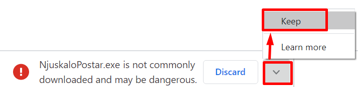
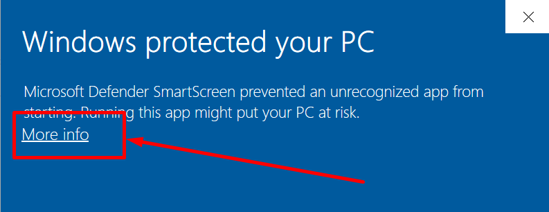
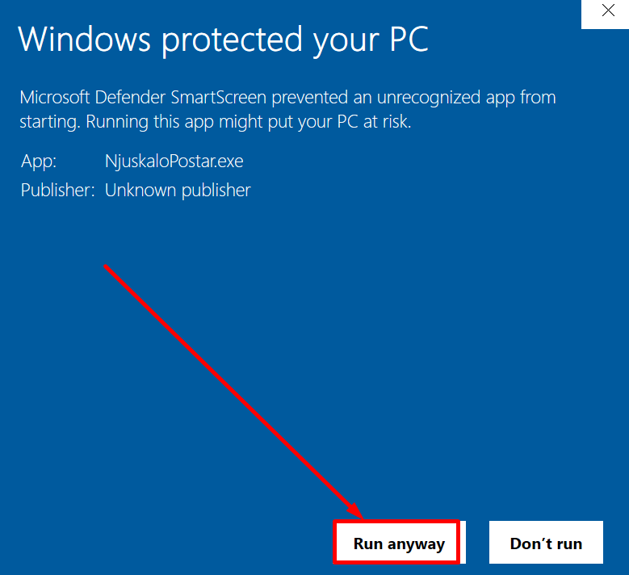
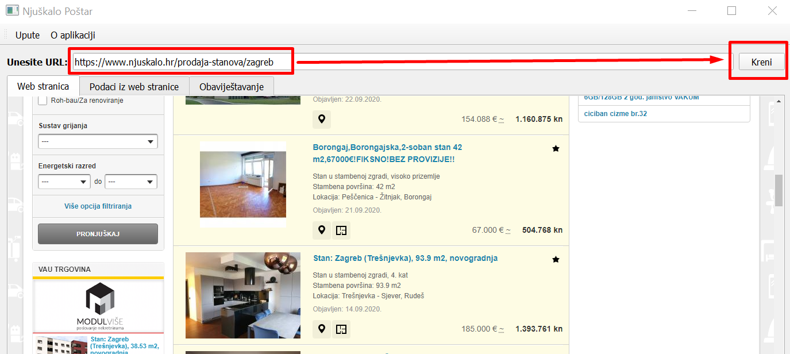
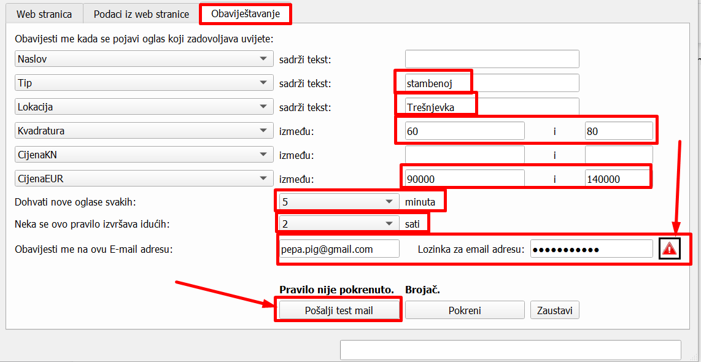
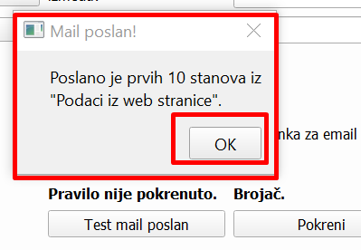
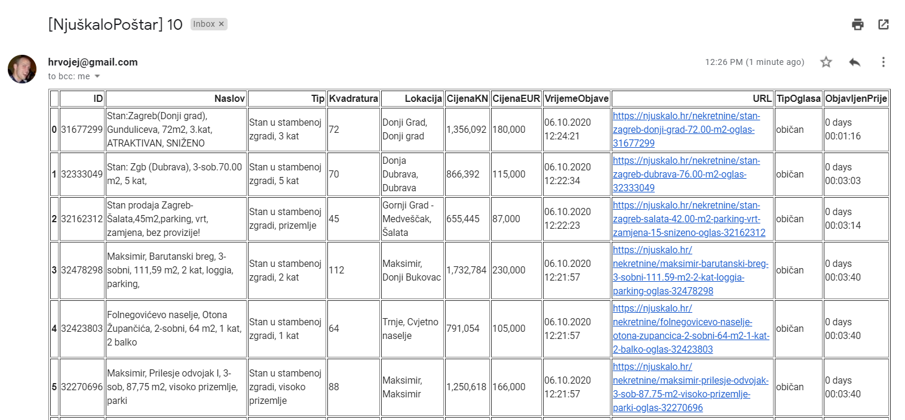
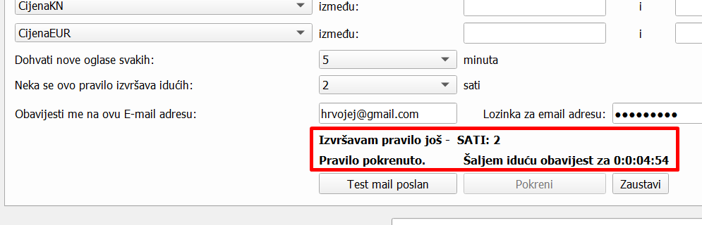

O aplikaciji
============
Aplikacija za dohvat, analizu i obaviještavanje o traženim nekretninama na temelju podataka sa njuškalo.hr stranice.
Za više informacija i licenciranju produkcijske verzije aplikacije obratite se na `hrvojej@gmail.com <mailto:hrvojej@gmail.com>`_.

Slobodno se obratiti i ako imate specifičnih zahtjeva glede dohvata, analize i definiranje poslovne logike nad podacima iz ostalih web stranica ili različitih ostalih izvora podataka (baza i skladišta podataka, raznih nestrukturiranih podataka i sl.)

Download
========
Aplikaciju možete preuzeti na ovom linku:
https://github.com/hrvojej/njuskalopostardocs/releases/download/0.0.1/NjuskaloPostar.exe

Ako prilikom download dobijete ovakvo upozorenje slobodno ga ignorirajte i kliknite na strelicu prema gore i odaberite opciju "Keep" ili "Zadrži" ovisno na kojem vam je jeziku pretraživač:  

Web pretraživači mogu izbaciti takvo upozorenje jer se radi o aplikaciji o kojoj ne znaju ništa. Aplikacija svakako nema nikakvih crva ili virusa. Vlastiti antivirusni softver će vas prilikom instalacije automatski upozoriti ukoliko postoje bilo kakve sigurnosne prijetnje.

Instalacija aplikacije
======================
Iz istog razloga će vam Windows javiti upozorenje koje također možete ignorirati.  Klikinte na “**More info**”:

I zatim na “**Run anyway**” :

Video upute
===========

Ovaj video od 4 minute će vam pokazati sve mogućnosti aplikacije:

.. raw:: html

    

        <iframe width="560" height="315" src="https://www.youtube.com/embed/0HAdDIZVI-8" frameborder="0" allow="accelerometer; autoplay; clipboard-write; encrypted-media; gyroscope; picture-in-picture" allowfullscreen></iframe>
    

Dohvat podataka sa njuskalo.hr stranice
================================================
Pod  “**Unesite URL**” postavite web adresu iza koje stoje oglasi iz kategorije Prodaja/Stanovi sa njuskalo.hr. 
Savjetujemo da unesete link sa već podešenim filterima na Njuškalu tipa:

`https://www.njuskalo.hr/prodaja-stanova?locationIds=2676&livingArea%5Bmin%5D=60&livingArea%5Bmax%5D=120&adsWithImages=1&flatBuildingType=flat-in-residential-building&flatFloorCount=single-floor&numberOfRooms%5Bmax%5D=two-rooms <https://www.njuskalo.hr/prodaja-stanova?locationIds=2676&livingArea%5Bmin%5D=60&livingArea%5Bmax%5D=120&adsWithImages=1&flatBuildingType=flat-in-residential-building&flatFloorCount=single-floor&numberOfRooms%5Bmax%5D=two-rooms>`_

Jer za pretpostaviti da tražite stan u određenom dijelu grada, određene veličine itd. 

Ovaj pogled je bitan kako biste bili sigurni da je program uspješno učitao web stranicu.

Analiza podataka iz web stranice
====================================
Kliknite na tab “**Podaci iz web stranice**”.
Crveno uokvireno su naslovi polja koji ujedno funkcioniraju kao i filteri. Slično kao u Excelu.
Ako kliknet na npr. polje “**Naslov**” otvoriti će vam se svi naslovi oglasa. Zatim idite na polje “**Pretraga**” (odmah iznad) i tu možete upisati tekst po kojem želite filtrirati polje “**Naslov**” npr. “*U zgradi*”. 
Na sličan način možete pretraživati i po ostalim poljima; prvo kliknite na polje a onda u polje pretrage unesete pojam po kojem želite pretraživati. 
Savjet je da proučite sadržaj pojedinih polja kako biste znali kreirati obavještavanje na slijedećem tabu.

Postavljanje obaviještavanja
====================================

Kliknite na tab “ Obavještavanje ”.
CIlj obaviještavanja je da vas aplikacija svakih odabrani broj minuta na vaš mail obavještava kada se pojavio novi oglas koji zadovoljava vaše kriterije. 
Na slici dolje dan je primjer kako možete podesiti obavještavanje.

Ako ste namjestili da se novi oglasi dohvaćaju svakih 5 minuta onda to znači da će se aplikacija svakih 5 minuta spajati na njuskalo.hr i na temelju danih kriterija dohvaćati nove oglase koji su se pojavili na njuskalu u zadnjih 5 minuta.  Ako nema niti jednog oglasa koji zadovoljava kriterij nećete dobiti nikakav email. 

Podešavanje email adrese
------------------------
Važno je napomenuti da ova aplikacije 

**ne skuplja, ne šalje i ne procesira vaše osobne podatke  niti skuplja podatke o korištenju same aplikacije. Sva komunikacije koju aplikacija ima je između nje same i njuskala.hr te Googlovog email servisa.**

Ova aplikacija zahtjeva da unesete i email adresu i email lozinku u nju. Zašto? Jer je to najjednostavniji, najbrži i besplatan način dohvata novih podataka i slanja obavijesti o istima. 
Svi ostali mehanizmi/aplikacije zahtjevaju plaćenu platformu ili kompleksne načine osobne autentifikacija na Google račun što nije trivijalan proces niti besplatan proces. A ova aplikacija je besplatna.
S obzirom da Google takve aplikacije doživljava kao “manje sigurne” stoga morate dopustiti “manje sigurnim aplikacijama” dopuštenje da šalju email na vaš Google račun. 

Kako dopustiti manje sigurnim aplikacijama da mi šalju email?
-------------------------------------------------------------
Idite na https://myaccount.google.com/lesssecureapps. Nakon što uključite tu opcije pomoću slidera, na mjestu gdje pokazuje 1. Strelica mora stajati “**ON”.**	

.. image:: ./images/kix.f7i1vn98ta.png

Ako nećete neko vrijeme koristiti ovu aplikaciju Google će automatski isključiti ovu opciju i postaviti je na **OFF**.

Vašem gmail računu se neće ništa desiti ako tu opciju uključite, no da biste ostali apsolutno zaštićeni toplo preporučamo da kreirate novi google račun pa njega koristite sa ovom aplikacijom. Evo adrese za izradu novog Google računa https://accounts.google.com/signup.

Druga prednost korištenja novog Google računa je da ćete sa tog računa primati samo obavijesti iz ove aplikacije, dakle nećete imati tone drugih nevažnih obavijesti koje inače dobivate ako koristiti neki Google account duže vrijeme.

Slanje testnog emaila
---------------------
Kada popunite cijeli obrazac za obavještavanje prije nego pokrenete pravilo obavještavanja važno je vidjeti da li aplikacija može uspješno slati mailove na vaš račun.

Dovoljno je da kliknete na “**Pošalji test mail**” gumb i potom provjerite vaš mail. Aplikacije će poslati 10 testnih zapisa iz trenutnog prikaza taba “**Podaci iz web stranice**”.
Nakon klika dobiti ćete obavijest:

Kliknite OK i provjerite mail koji ste unijeli. Testni mail će biti sličan ovome: 

Dakle spremni ste za pokretanje pravila. 

Pokretanje pravila
========================
Pravilo pokrećete sa klikom na gumb “**Kreni**”, a zaustavljate ga sa klikom na gumb “**Zaustavi**” (sasvim neobično zar ne? :) ).

U području iznad tih gumbiju vidjeti ćete obavijesti o trenutnom statusu procesa obavještavanja kao što je prikazano na slici dolje:

Licenca
============
Dopušteno je  korištenje i distribucija ove aplikacije u komercijalne i nekomercijalne svrhe. 

Budući razvoj
==============
Kroz daljnji razvoj planira se :

* Implementacija dohvata sa oglasa sa ostalih portala: index.hr, oglasnik.hr itd.
* Implementacija kreiranja više različitih pravila obavještavanja odjednom

