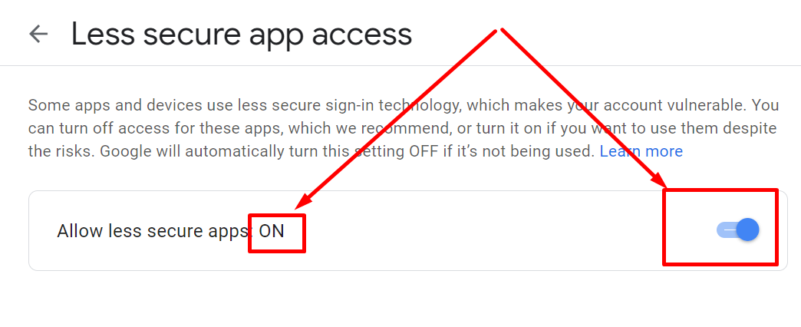

O aplikaciji
============
**PRIMAJTE OBAVIJESTI O NOVIM TRAŽENIM NEKRETNINAMA SA NJUSKALO.HR STRANICE SVAKIH 5 MINUTA NA VAŠ MAIL**
Njuškalo Poštar je aplikacija za dohvat, analizu i obaviještavanje o traženim nekretninama na temelju podataka sa njuškalo.hr stranice.
Ako trebate više informacije, želite izraditi sličnu aplikaciju, ili imate neki drugi upit - obratite se na hrvojej@gmail.com.

O autoru
========
Zovem se Hrvoje, volim programirati, predajem na faksu i radim projekte iz područja podatkovne znanosti.

Više o meni: 
https://www.linkedin.com/in/hjerkovic/
i
https://www.algebra.hr/visoko-uciliste/studij/diplomski-studij/podatkovni-smjer/nastavni-plan/metode-strojnog-ucenja/2789/doc-dr-sc-hrvoje-jerkovic/324/

Primjer projekta - procjena cijene automobila na temelju podataka iz sva tri ključna oglasnika (Njuskalo.hr, Index.hr i Oglasnik.hr):

https://www.oglasnik.hr/procjena-cijene-automobila

Učestala pitanja
================
Da li je to sigurna aplikacija koja nema crva, virusa i sl. u sebi?
-------------------------------------------------------------------
Naravno, pogledajte izvještaj sa virustotal.com sitea koji skenira aplikacije kroz sve najvažnije antivirusne softvere.
Izvještaj je ovdje:

https://www.virustotal.com/gui/url/3c6fbcd1eb190c34ea5ca0a17cfb71d7bb0e98d0a81de354668afe0aa08e12d4/detection

No zašto vjerovati meni - skenirajte i sami aplikaciju sa vašim antivirusnim softverom pa vidite hoće li vam što javiti.

Zašto mi Google Chrome javlja upozorenje kada preuzimam aplikaciju?
-------------------------------------------------------------------
Zato što aplikacija nije često preuzimana pa Google ne zna o njoj ništa.

Zašto mi Windowsi javljaju upozorenje kada pokušam instalirati aplikaciju?
--------------------------------------------------------------------------
Zato što niti Microsoft ne zna ništa o aplikaciji jer nije često preuzimana i nema certifikat. Nemam namjeru kupovati certifikat pa će to upozorenje ostati. No ako dovoljan broj ljudi bude koristio aplikaciju Microsft će s vremenom sam maknuti to upozorenje i isto vrijedi i za Google Chrome.

Zašto mi Google javlja upozorenje kada uključim pristup manje sigurnim aplikacijama (Less secure apps)?
-------------------------------------------------------------------------------------------------------
Zato što se radi o aplikaciji koja nema visoku sigurnosnu proceduru implementiranu kroz Googleov sustav jer bi to svaki korisnik trebao zasebno raditi kroz svoj Google account što se ne može očekivati od običnog korisnika aplikacije. 
Što ne znači da će vam netko hakirati Gmail zbog toga - to nije moguće ako sami ne date privolu za to.

Ova aplikacija vas obaviještava na vaš mail jer je to najjednostavniji i jedini besplatan način rada koji ne zahtjeva uspostavu nekog centralnog servisa za slanje maila koji košta i zahtjeva dodatnu infrastrukturu. 
Aplikacija stoga treba vaš email i lozinku od maila koja se koristi isključivo unutar aplikacije za slanje obavijesti na vaš maila i nigdje drugdje. Stoga je bitno napomenuti da ova aplikacija 

**ne skuplja, ne šalje i ne procesira vaše osobne podatke  niti skuplja podatke o korištenju same aplikacije niti na bilo koji drugi način krši GDPR zakon o osobnim podacima. Sva komunikacije koju aplikacija ima je između nje same i njuskala.hr te Googlovog email servera koji se koristi za slanje email obavijesti.**

Ako i dalje smatrate da bi aplikacija ugrozila vaš Google account preporuka je da otvorite novi Google account koji ćete koristiti samo za obaviještavanje kroz ovu aplikaciju:

https://accounts.google.com/signup/v2/webcreateaccount?flowName=GlifWebSignIn&flowEntry=SignUp

Onda obavijesti koje dolaze na taj Gmail account možete preusmjeriti na Google account koji koristite. 

Download
========
Aplikaciju možete preuzeti na ovom linku:

https://github.com/hrvojej/njuskalopostardocs/releases/download/v0.1.0-beta2/NjuskaloPostar.exe

Ako prilikom download dobijete ovakvo upozorenje slobodno ga ignorirajte i kliknite na strelicu prema gore i odaberite opciju "Keep" ili "Zadrži" ovisno na kojem vam je jeziku pretraživač:  

.. image:: ./images/kix.uxtxxca1t4ag.png

Web pretraživači mogu izbaciti takvo upozorenje jer se radi o aplikaciji o kojoj ne znaju ništa. Aplikacija svakako nema nikakvih crva ili virusa. Vlastiti antivirusni softver će vas prilikom instalacije automatski upozoriti ukoliko postoje bilo kakve sigurnosne prijetnje.

Instalacija aplikacije
======================
Iz istog razloga će vam Windows javiti upozorenje koje također možete ignorirati.  Klikinte na “**More info**”:

.. image:: ./images/kix.z6lunu8t6lx2.png

I zatim na “**Run anyway**” :

.. image:: ./images/kix.tg7mjifdvni3.png

Video upute
===========

Ovaj video od 4 minute će vam pokazati sve mogućnosti aplikacije:

.. raw:: html

    

        <iframe width="800" height="600" src="https://www.youtube.com/embed/0HAdDIZVI-8?vq=hd1080" frameborder="0" allow="accelerometer; autoplay; clipboard-write; encrypted-media; gyroscope; picture-in-picture" allowfullscreen></iframe>
    

Dohvat podataka sa njuskalo.hr stranice
================================================
Pod  “**Unesite URL**” postavite web adresu iza koje stoje oglasi iz kategorije Prodaja/Stanovi sa njuskalo.hr. 
Savjetujemo da unesete link sa već podešenim filterima na Njuškalu tipa:

`https://www.njuskalo.hr/prodaja-stanova?locationIds=2676&livingArea%5Bmin%5D=60&livingArea%5Bmax%5D=120&adsWithImages=1&flatBuildingType=flat-in-residential-building&flatFloorCount=single-floor&numberOfRooms%5Bmax%5D=two-rooms <https://www.njuskalo.hr/prodaja-stanova?locationIds=2676&livingArea%5Bmin%5D=60&livingArea%5Bmax%5D=120&adsWithImages=1&flatBuildingType=flat-in-residential-building&flatFloorCount=single-floor&numberOfRooms%5Bmax%5D=two-rooms>`_

Jer za pretpostaviti da tražite stan u određenom dijelu grada, određene veličine itd. 

.. image:: ./images/kix.53nm7xvsyw6n.png

Ovaj pogled je bitan kako biste bili sigurni da je program uspješno učitao web stranicu.

Analiza podataka iz web stranice
====================================
Kliknite na tab “**Podaci iz web stranice**”.
Crveno uokvireno su naslovi polja koji ujedno funkcioniraju kao i filteri. Slično kao u Excelu.
Ako kliknet na npr. polje “**Naslov**” otvoriti će vam se svi naslovi oglasa. Zatim idite na polje “**Pretraga**” (odmah iznad) i tu možete upisati tekst po kojem želite filtrirati polje “**Naslov**” npr. “*U zgradi*”. 
Na sličan način možete pretraživati i po ostalim poljima; prvo kliknite na polje a onda u polje pretrage unesete pojam po kojem želite pretraživati. 
Savjet je da proučite sadržaj pojedinih polja kako biste znali kreirati obavještavanje na slijedećem tabu.

Postavljanje obaviještavanja
====================================

Kliknite na tab “ Obavještavanje ”.
CIlj obaviještavanja je da vas aplikacija svakih odabrani broj minuta na vaš mail obavještava kada se pojavio novi oglas koji zadovoljava vaše kriterije. 
Na slici dolje dan je primjer kako možete podesiti obavještavanje.

.. image:: ./images/kix.u6gjg8i41bdq.png

Ako ste namjestili da se novi oglasi dohvaćaju svakih 5 minuta onda to znači da će se aplikacija svakih 5 minuta spajati na njuskalo.hr i na temelju danih kriterija dohvaćati nove oglase koji su se pojavili na njuskalu u zadnjih 5 minuta.  Ako nema niti jednog oglasa koji zadovoljava kriterij nećete dobiti nikakav email. 

Podešavanje email adrese
------------------------

Ova aplikacija zahtjeva da unesete i email adresu i email lozinku u nju. Zašto? Jer je to najjednostavniji, najbrži i besplatan način dohvata novih podataka i slanja obavijesti o istima. 
Svi ostali mehanizmi/aplikacije zahtjevaju plaćenu platformu ili kompleksne načine osobne autentifikacija na Google račun što nije trivijalan proces niti besplatan proces. A ova aplikacija je besplatna.
S obzirom da Google takve aplikacije doživljava kao “manje sigurne” stoga morate dopustiti “manje sigurnim aplikacijama” dopuštenje da šalju email na vaš Google račun. 

Kako dopustiti manje sigurnim aplikacijama da mi šalju email?
-------------------------------------------------------------
Idite na https://myaccount.google.com/lesssecureapps. Nakon što uključite tu opcije pomoću slidera, na mjestu gdje pokazuje 1. Strelica mora stajati “**ON”.**	

Ako nećete neko vrijeme koristiti ovu aplikaciju Google će automatski isključiti ovu opciju i postaviti je na **OFF**.

Vašem gmail računu se neće ništa desiti ako tu opciju uključite, no da biste ostali apsolutno zaštićeni toplo preporučamo da kreirate novi google račun pa njega koristite sa ovom aplikacijom. Evo adrese za izradu novog Google računa https://accounts.google.com/signup.

Druga prednost korištenja novog Google računa je da ćete sa tog računa primati samo obavijesti iz ove aplikacije, dakle nećete imati tone drugih nevažnih obavijesti koje inače dobivate ako koristiti neki Google account duže vrijeme.

Slanje testnog emaila
---------------------
Kada popunite cijeli obrazac za obavještavanje prije nego pokrenete pravilo obavještavanja važno je vidjeti da li aplikacija može uspješno slati mailove na vaš račun.

Dovoljno je da kliknete na “**Pošalji test mail**” gumb i potom provjerite vaš mail. Aplikacije će poslati 10 testnih zapisa iz trenutnog prikaza taba “**Podaci iz web stranice**”.
Nakon klika dobiti ćete obavijest:

.. image:: ./images/kix.97y348a08h70.png

Kliknite OK i provjerite mail koji ste unijeli. Testni mail će biti sličan ovome: 

.. image:: ./images/kix.xqogntbnpin0.png

Dakle spremni ste za pokretanje pravila. 

Pokretanje pravila
========================
Pravilo pokrećete sa klikom na gumb “**Kreni**”, a zaustavljate ga sa klikom na gumb “**Zaustavi**” (sasvim neobično zar ne? :) ).

U području iznad tih gumbiju vidjeti ćete obavijesti o trenutnom statusu procesa obavještavanja kao što je prikazano na slici dolje:

Smisao je da vam aplikacija bude stalno pokrenuta tijekom cijelog radnog vremena i da dobivate obavijest na mail samo kada se pojavi tražena nekretnina.

Pravilo može biti pokrenuto najduže 124 sata (cijeli radni tjedan) i najčešće se može provjeravati svakih 5 minuta.

Budući razvoj
==============
Kroz daljnji razvoj planira se :

* Implementacija dohvata sa oglasa sa ostalih portala: index.hr, oglasnik.hr itd.
* Implementacija kreiranja više različitih pravila obavještavanja odjednom

